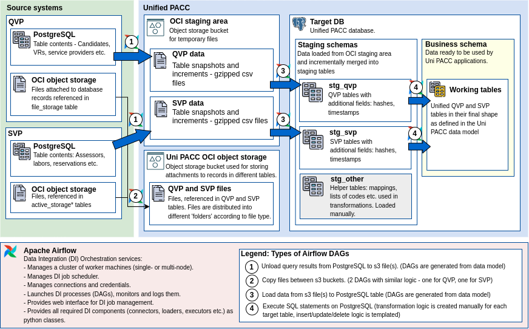

Migration Plan
===============

Approach
---------

To implement migration along the same design patterns as used for
implementation of Data Warehouses.

### Assumptions ###

There are 2 kinds of data that must be migrated:

1. Database tables in 2 PostgreSQL databases - QVP and SVP.
2. Files in OCI object storage for QVP and SVP.

Target storage:

1. 1 PostgreSQL database - Uni PACC.
2. OCI object storage for files.

### Incremental Loads ###

Data are going to be moved in two phases:

1. Bulk migration - all data from all tables, all files are moved to the target storages.
2. Incremental migration - periodical extraction of new/changed data
   from source tables and from OCI object storage.

The approach outlined above allows to make the transition smooth,
provides room for error during every step of migration and
reduces load on source databases.

### Cutover Plan ###

After successful bulk migration and several incremental migrations, 
a set of test queries are run on source and target databases to ensure that
all data have been copied, certain key indicators match on the source and on the target.
Uni PACC application is tested on prod environment with several test user accounts
to make sure there are no errors in relationships between tables, semantics of the data model is not
damaged during migration, all files are in place.

When there are no more errors, source applications go offline,
the last incremental load is executed and the target system goes online.

### Data Layers ###

These are the steps to move data from source DBs to target DB:

1. Extract changed records, move them to OCI object storage in csv files.
2. Read a file from OCI object storage, load it into a temporary table in the 'staging area'
   of the target database.
3. Read temporary table, merge it into the permanent table in the 'staging area'.
3. Select and transform data from tables in the staging area in the target database and
   merge results of the transformation into the final tables.

After each step data ends up in one of three 'data layers':

1. OCI Staging layer (OCI) - source data converted to gzipped csv files.
2. Target DB staging layer (STG)  - copies of data from source systems.
3. Business layer (BL) - data transformed to Uni PACC data model.

### Independent DI Processes ###

One 'STG' DI process loads a cnunk of changed records from one source table
into one table in the STG layer.

One 'BL' DI process loads changed records (or fully reloads)
one table in the BL.

Processes can be launched independently of each other.

Processes can be launched several times without any negative consequences.

Processes can be chained together to form a 'pipeline' that loads
several tables at once. Each process of the pipeline still can be launched
independently without any problem.

Tools
------

The approach described above can be implemented using different tools.
However for the sake of clarity I am describing in detail
how it can be implemented using Apache Airflow as the core integration machine.

The choice of Airflow was determined by the following factors:

1. Airflow is a mature professional level DI system well-proven in the industry;
2. Airflow DI process or 'DAG' is defined as a simple python file. Usually
   it is trivial but can be as complex as the developer wants it to.
3. With Airflow there are many ways to generate hundreds of uniform DAGs using simple
   JSON or YAML config files.
4. Airflow integrates smoothly with Git and CI/CD processes.
5. All the necessary Airflow libraries (a.k.a Providers), that contain
   DB connectors, S3 readers/writers etc. are available as open source.
6. Any custom extensions to Airflow are easy to implement in python.

Data Integration Architecture
------------------------------

### Diagram ###

### Description ###

Environments
-------------

