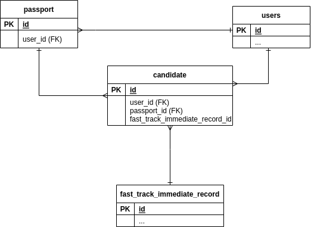

Candidates
============

Diagram
--------

Tables used
---------------

TABLE NAME                         | DESCRIPTION
-----------------------------------|--------------------------
[`candidate`](../tables/candidate.md) | Info about candidates. FK to passport. FK to Fast Track Immediate Record ID
[`fast_track_immediate_record`](../tables/fast_track_immediate_record.md) | TODO: clarify
[`passport`](../tables/passport.md)   | User passports
[`users`](../tables/users.md)         | Users 
