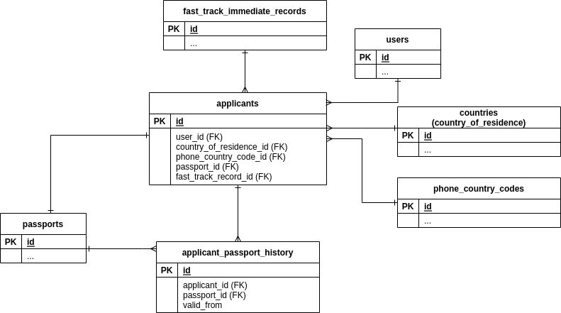

Applicants
========================

Applicants table, and tables that are connected to it in some way.

Diagram
--------

Tables
-------

### Main table ###

- [applicants](../tables/applicants.md)  

### Passports ###

- [passports](../tables/passports.md)
- [applicant_passport_history](../tables/applicant_passport_history.md)

`applicant_pasport_fistory` is a 'historical' table that is used to
track changes in `applicants.passport_id` field.

### Other tables ###

- [countries](../tables/countries.md)
- [fast_track_immediate_records](../tables/fast_track_immediate_records.md)
- [phone_country_codes](../tables/phone_country_codes.md)
- [users](../tables/users.md)