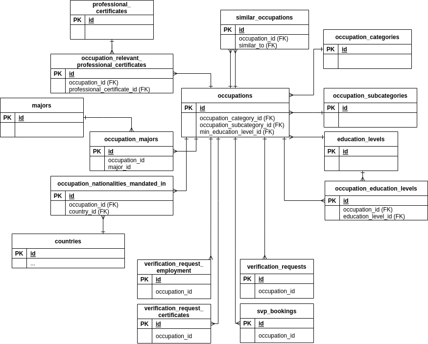

Occupations
===============

Occupations and tables that are connected to it.

Diagram
--------

Tables
-------

### Main table ###

- [occupations](../tables/occupations.md)  

### Other tables ###

- [professional_certificates](../tables/professional_certificates.md)
- [similar_occupations](../tables/similar_occupations.md)
- [occupation_categories](../tables/occupation_categories.md)
- [occupation_subcategories](../tables/occupation_subcategories.md)
- [education_levels](../tables/education_levels.md)
- [occupation_education_levels](../tables/occupation_education_levels.md)
- [occupation_relevant_professional_certificates](../tables/occupation_relevant_professional_certificates.md)
- [majors](../tables/majors.md)
- [occupation_majors](../tables/occupation_majors.md)
- [occupation_nationalities_mandated_in](../tables/occupation_nationalities_mandated_in.md)
- [countries](../tables/countries.md)
- [verification_request_employment](../tables/verification_request_employment.md)
- [verification_request_certificates](../tables/verification_request_certificates.md)
- [verification_requests](../tables/verification_requests.md)
- [svp_bookings](../tables/svp_bookings.md)           
