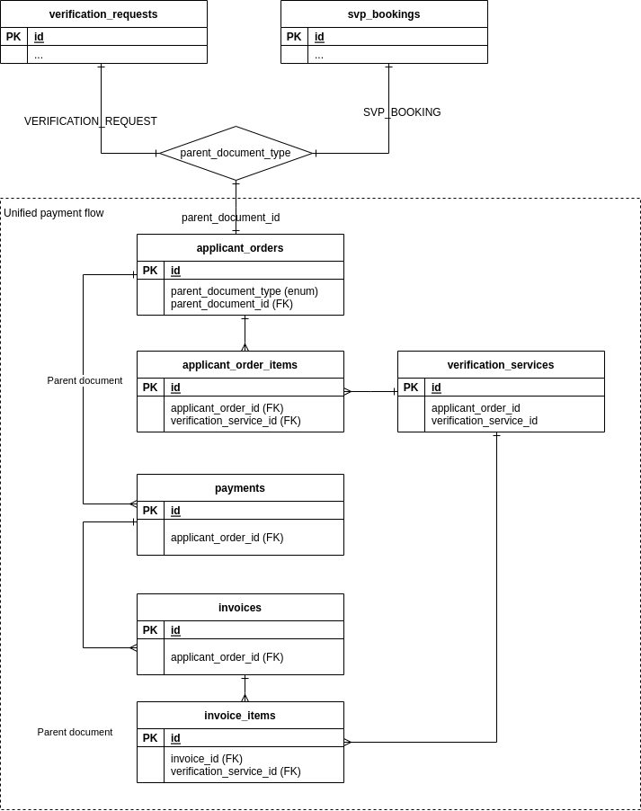

Orders
========================

The diagram represents the process of applicant's 'ordering' Takamol verification services,
paying for them, and receiving the invoice.

The Diagram
------------

Description
-------------

A new entity - "Applicant's order" has been added
in order to unify ordering and payments for two separate processes - QVP verification requests and SVP bookings.
An order is modelled along the same lines as orders are usually modelled for online shops.

The order entity consists of two tables:

- the main table - [applicant_orders](../tables/applicant_orders.md)
- order items or 'lines' - [applicant_order_items](../tables/applicant_order_items.md).

An order usually consist of only one line - "Qualification verification request" or
"Skill verification request". But an additional items (lines) may be added to the order, for example, "Additional fee".

An order item references another new table - [verification_services](../tables/verification_services.md).
This table acts as a 'products' table and currently will contain only 3 records:

1. Qualification verification request
2. Skill verification exam
3. Additional fee for qualification verification

The order is created either from [verification_requests](../tables/verification_requests.md)
or [svp_bookings](../tables/svp_bookings.md) and references one of these
documents as the 'parent' document.

The [payments](../tables/payments.md) is a universal payment for QVP and SVP.
The payment is created from the order and references the order as the 'parent' entity.

The [invoices](../tables/invoices.md) is also universal for QVP and SVP. The invoice is created from payment
and references the payment as the 'parent' document.
The invoice has almost the same structure as the Order with a separate [invoice_items](../tables/invoice_items) table.

All Tables in the Diagram
---------------------------

### QVP and SVP Requests ###

- [verification_requests](../tables/verification_requests.md)  
- [svp_bookings](../tables/svp_bookings.md)  

### Orders ###

- [applicant_orders](../tables/applicant_orders.md)  
- [applicant_order_items](../tables/applicant_order_items.md)  

### Products ###

- [verification_services](../tables/verification_services.md)  

### Payments ###

- [payments](../tables/payments.md)  

### Invoices ###

- [invoices](../tables/invoices.md)  
- [invoice_items](../tables/invoice_items.md)  
