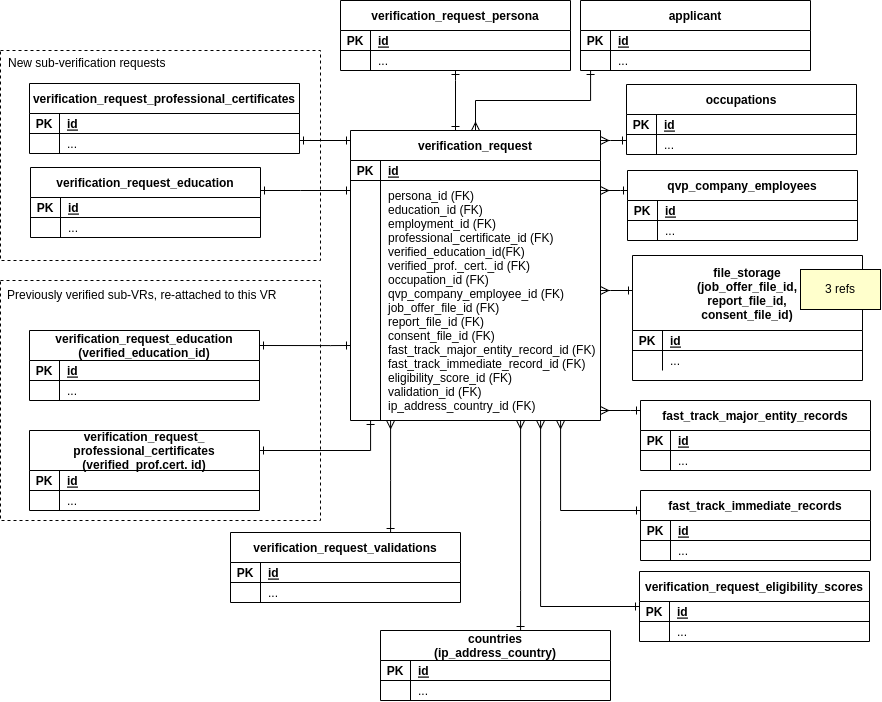

Verification Request 1
========================

Verification Request (VR), tables that it references and tables that
have one-to-one relationships with VR.

Diagram
--------

Tables
-------

### Main table ###

- [verification_requests](../tables/verification_requests.md)  

### Sub-VRs ###

- [verification_request_education](../tables/verification_request_education.md)
- [verification_request_professional_certificates](../tables/verification_request_professional_certificates.md)

Each of these tables is referenced twice from different fields: 1) as a new sub-VR
that must be verified as part of the current VR, or 2) as a sub-VR that has already
been verified previously and according the the business logic belongs to
another VR, but can be referenced from the current VR.

### Extensions ###

This is an 'extension' table meaning that it has one-to-one relationship
with VR and contains fields that could have been in `verification_requests` table itself,
but they have been historically kept in a separate table.

- [verification_request_personas](../tables/verification_request_personas.md)

### Other tables referenced from VR ###

- [applicants](../tables/applicants.md)
- [countries](../tables/countries.md)
- [fast_track_major_entity_records](../tables/fast_track_major_entity_records.md)
- [fast_track_immediate_records](../tables/fast_track_immediate_records.md)
- [file_storage](../tables/file_storage.md)
- [occupations](../tables/occupations.md)
- [qvp_company_employees](../tables/qvp_company_employees.md)
- [verification_request_eligibility_scores](../tables/verification_request_eligibility_scores.md)
- [verification_request_validations](../tables/verification_request_validations.md)